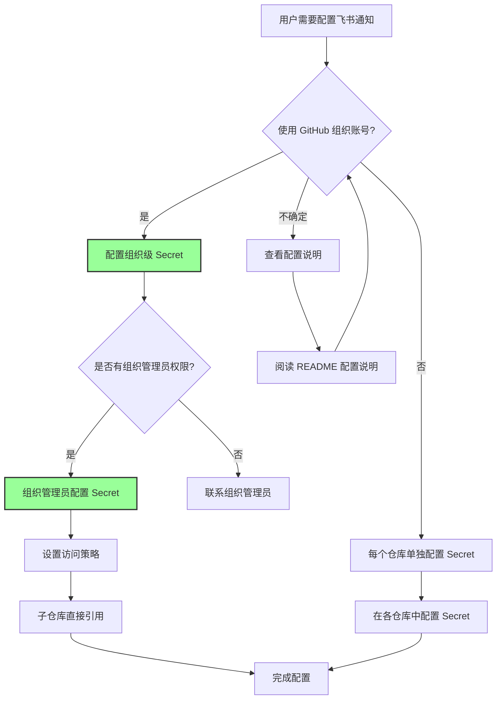
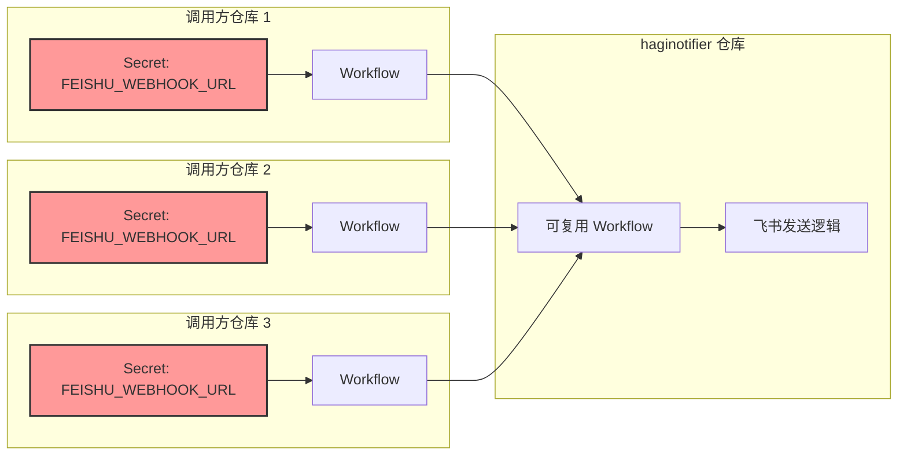
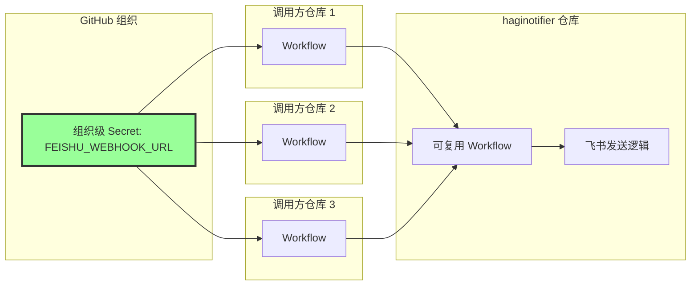

# Design: 统一多仓库飞书通知Secret配置方案

## Context

haginotifier 是一个可复用的 GitHub Actions workflow，用于向飞书发送通知。当前实现要求每个调用方仓库单独配置 `FEISHU_WEBHOOK_URL` Secret。这导致在多仓库场景下：
1. 配置负担高：每个仓库都需要单独配置 Secret
2. Secret 分散：管理成本大，更新时需要逐个修改
3. 容易遗漏或出错：Secret 变更时可能遗漏某些仓库

### Constraints

- GitHub 默认安全隔离机制：不同仓库之间的 Secret 互相不可见
- 可复用 workflow 中定义的 secrets 必须由调用方显式传递
- `secrets.inherit` 仅适用于同组织/企业内的调用，且调用方仍需配置 Secret
- 需要支持 GitHub 组织和个人账号两种场景

### Stakeholders

- **仓库维护者**：希望降低多仓库 Secret 管理成本
- **调用方仓库管理员**：希望简化配置流程
- **组织管理员**：需要统一管理组织内的 Secret
- **个人账号用户**：需要无需组织权限的解决方案

## Goals / Non-Goals

### Goals

- 实现一处配置、多仓库共享的目标
- 降低多仓库场景下的 Secret 管理成本
- 提供安全的 Secret 隔离方案
- 支持组织和个人账号两种场景
- 保持向后兼容性，不破坏现有使用方式

### Non-Goals

- 不强制要求现有用户迁移到新方案
- 不修改现有的可复用 workflow 核心逻辑
- 不引入外部依赖或第三方服务
- 不支持除飞书外的其他通知渠道（此为独立需求）

## Decisions

### Decision 1: 采用组织级 Secret 方案

**选择**：使用 GitHub 组织级 Secret 功能。

**理由**：
- 组织级 Secret 是官方推荐方案，最安全
- 一处配置，多处共享，管理成本最低
- 完全符合 GitHub 安全隔离机制
- 更新 Secret 时仅需修改一次即可应用到所有授权仓库

**替代方案**：
- 仅提供组织级 Secret：排除个人账号用户
- 仅提供 Repository Dispatch：给有组织权限的用户带来额外复杂度

**实际采用情况**：
> **2026-02-09 更新**：项目已采用 **组织级 Secret** 方案。用户已完成组织级 Secret 的配置，现需要更新 README 文档以反映此变更。

### Decision 2: 保持向后兼容性

**选择**：不修改现有的 Secret 传递方式，组织级 Secret 作为可选的增强功能。

**理由**：
- 现有用户无需任何改动即可继续使用
- 降低迁移风险
- 允许用户根据自身情况选择合适的时机迁移

**替代方案**：
- 强制迁移：会破坏现有使用方式，增加用户负担

## UI/UX Design

本变更不涉及用户界面设计，主要关注配置体验。

### 配置流程对比

#### 当前方式（每个仓库单独配置）

```
1. 在每个需要通知的仓库中配置 FEISHU_WEBHOOK_URL Secret
2. 在 workflow 中显式传递 Secret
3. 重复步骤 1-2 对每个仓库

问题：配置重复、管理成本高、更新困难
```

#### 组织级 Secret 方案

```
1. 组织管理员一次性配置组织级 Secret
2. 设置访问策略（允许哪些仓库使用）
3. 子仓库直接引用，无需单独配置

优势：一处配置、多处共享、管理成本低
```

### 配置流程



## Technical Design

### 架构对比

#### 当前架构



**问题**：每个仓库都存储相同的 Secret，管理成本高。

#### 方案 A：组织级 Secret



**优势**：一处配置，多处共享。

### 调用方配置示例

#### 组织级 Secret 调用示例

```yaml
# 与现有方式完全相同，只是 Secret 来源变为组织级
jobs:
  notify:
    uses: HagiCode-org/haginotifier/.github/workflows/notify.yml@main
    with:
      message: '部署成功！'
    secrets:
      FEISHU_WEBHOOK_URL: ${{ secrets.FEISHU_WEBHOOK_URL }}
```

## Risks / Trade-offs

### Risk 1: 个人账号用户无法使用

**风险**：非组织用户无法使用组织级 Secret 功能。

**缓解措施**：
- 在文档中明确说明此限制
- 个人账号用户仍可使用传统的每个仓库单独配置 Secret 的方式
- 未来可考虑添加 Repository Dispatch 方案作为补充

### Risk 2: 组织管理员权限要求

**风险**：配置组织级 Secret 需要组织管理员权限。

**缓解措施**：
- 提供详细的配置指南，方便组织管理员操作
- 说明设置访问策略的重要性
- 提供验证清单确保配置正确

## Migration Plan

### 迁移到组织级 Secret

#### 步骤

1. 组织管理员在组织设置中创建 `FEISHU_WEBHOOK_URL` Secret
2. 配置访问策略，选择允许使用的仓库
3. 子仓库管理员从仓库设置中删除现有的 `FEISHU_WEBHOOK_URL` Secret（可选）
4. 验证 workflow 仍能正常工作

#### 验证清单

- [ ] 组织级 Secret 已创建
- [ ] 访问策略已正确配置
- [ ] 至少一个子仓库的 workflow 成功运行
- [ ] 通知成功发送到飞书

#### 回滚方案

- 在子仓库中重新创建 `FEISHU_WEBHOOK_URL` Secret
- 现有 workflow 无需修改

## Open Questions

1. **是否需要支持个人账号用户**：是否需要为个人账号用户提供 Repository Dispatch 方案？
   - **建议**：暂不实现，保持方案简单。如有需求可后续添加。

## Implementation Status

### 已完成项目

- [x] 组织级 Secret 已配置
- [x] 组织级 Secret 方案已采用并测试通过

### 待完成项目

- [ ] README.md 更新（添加组织级 Secret 配置说明）

### 更新记录

| 日期 | 更新内容 | 状态 |
|------|---------|------|
| 2026-02-09 | 初始提案创建（包含方案 A 和 B） | ✅ |
| 2026-02-09 | 用户确认采用组织级 Secret 方案 | ✅ |
| 2026-02-09 | 组织级 Secret 配置完成 | ✅ |
| 2026-02-09 | 移除方案 B（Repository Dispatch）相关内容 | ✅ |
| 待定 | README 文档更新 | 🔄 进行中 |
