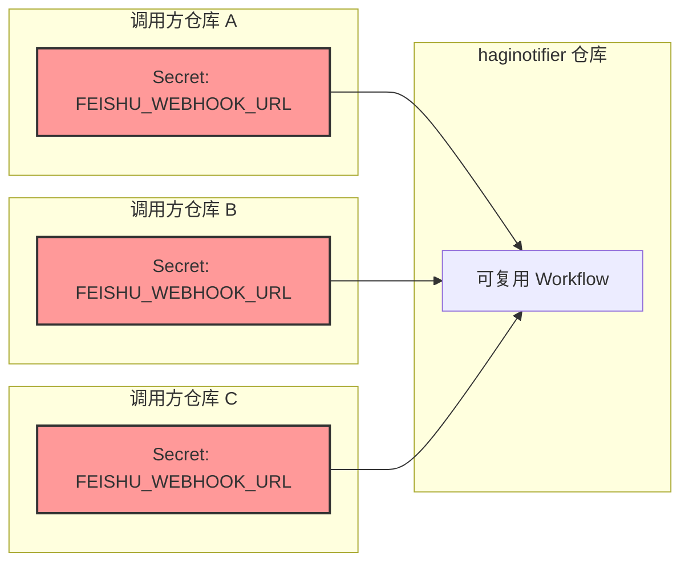
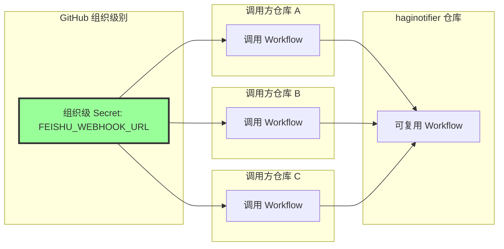
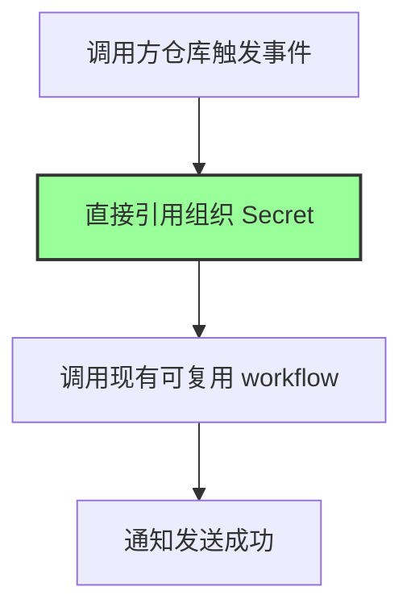

# Change: 统一多仓库飞书通知Secret配置方案

## Why

当前可复用 workflow 要求每个调用方仓库必须单独配置 `FEISHU_WEBHOOK_URL` Secret，在多仓库场景下带来配置负担高、Secret 分散、管理成本大的问题。当需要更换 webhook URL 时，必须逐个更新所有调用仓库，容易遗漏或出错。

## What Changes

- 添加 **组织级 Secret** 配置指南（GitHub 组织推荐方案）
- 更新 README.md 添加配置方案的详细说明
- 提供迁移指南，帮助现有用户从当前方案迁移到新方案

## UI Design Changes

不适用 - 本变更仅涉及配置方案和文档更新，无用户界面变更。

## Code Flow Changes

### 当前架构 vs 新方案对比

#### 当前架构（每个仓库单独配置 Secret）

**问题**：每个仓库都需要配置 Secret，管理成本高，更新时需要逐个修改。

---

#### 方案 A：组织级 Secret

**优势**：一处配置，多处共享；官方推荐方案，最安全；管理成本最低。

---

### 代码变更清单

| 文件路径 | 变更类型 | 变更原因 | 影响范围 |
|---------|---------|---------|---------|
| `README.md` | 修改 | 添加组织级 Secret 配置说明和迁移指南 | 文档 |
| `openspec/changes/unified-feishu-secret-config/specs/github-actions-notification/spec.md` | 新增 | 添加新功能规范 | 规范文档 |

---

### 代码流程变更 - 组织级 Secret 工作流

---

## Impact

- Affected specs: `github-actions-notification` (MODIFIED - 添加新的配置方式)
- Affected code:
  - `README.md` - 添加配置方案说明和迁移指南

## 破坏性变更说明

**无破坏性变更**。组织级 Secret 为新增配置选项，现有使用方式（每个仓库单独配置 Secret）仍然完全有效。用户可选择：
1. 保持现有方案不变
2. 迁移到组织级 Secret 方案

## 实施状态

### 当前进展

| 项目 | 状态 | 说明 |
|------|------|------|
| 组织级 Secret 配置 | ✅ 已完成 | 用户已完成组织级 Secret 的配置 |
| 方案测试验证 | ✅ 已通过 | 组织级 Secret 方案已验证可用 |
| README 文档更新 | ✅ 已完成 | 已添加组织级 Secret 配置说明、迁移指南和故障排查 |

### 下一步行动

所有任务已完成：
- ✅ 更新 README.md，添加组织级 Secret 配置指南
- ✅ 添加迁移指南和验证检查清单
- ✅ 添加 FAQ 和故障排查指南
- ✅ 提案验证通过
